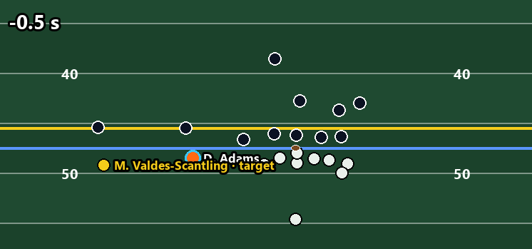
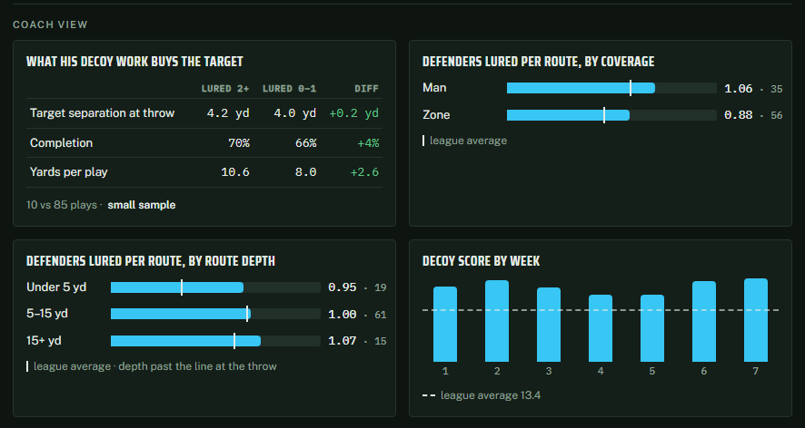
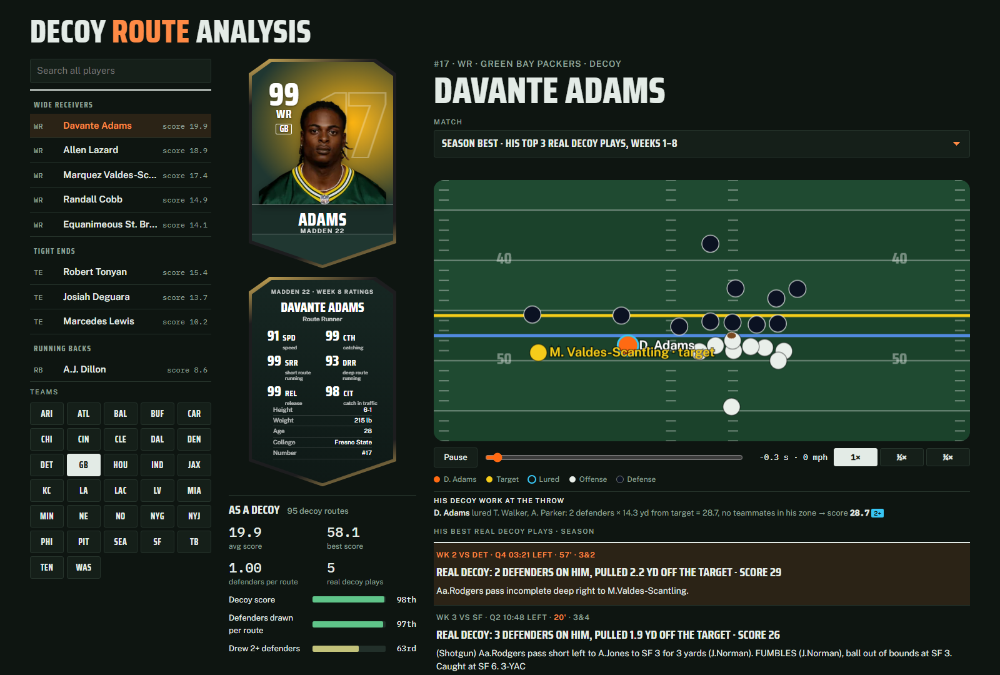

# Decoy Route Analytics & Off-Ball Receiver Impact

Good receivers can win a play without touching the ball by pulling defenders away from the target. We measured this from the tracking data and building a tracking metric that measures how effectively "decoy" receivers draw coverage defenders away from primary targets to open up high-probability passing lanes.

By evaluating defender spacing from the moment the ball is snapped until it is thrown, our model calculates the exact amount of open grass created for teammates. This proves that pulling defenders away on deep routes directly drives higher offensive success rates for the entire team. Our project pairs a Python data pipeline with an interactive 2D web application (`app/index.html` and `app_profiles/index.html`) so coaches and fans can replay animated plays and explore league-wide player leaderboards.

**Live demo:** https://temporary-spry-sable-dmgxyf7.vercel.app/#p41282

*Davante Adams, Week 2 vs Detroit, Q4 3:21 — real tracking, snap to throw. Orange: Adams (the decoy). Yellow: the target. Blue: the defenders he lured, tethered to him at the throw. Decoy score 28.7.*

*Coach view for the same player: target separation, completion and yards when he lures 2+ defenders vs 0–1; defenders lured per route against man and zone and by route depth, each against the league average; decoy score week by week.*

